# Laboratorio 1: Prototipado de Aplicaciones Móviles

## 1. Introducción al diseño de interfaces móviles

### 1.1. UI vs UX

Diseñar una aplicación no se trata solamente de que “se vea bien”, sino de que funcione bien para las personas que la usan. Esta idea está en el centro de la diferencia entre experiencia de usuario (UX) y diseño de interfaz (UI). Mientras que la UX se ocupa de cómo se siente usar la aplicación (fluidez, comprensión, confianza, eficiencia), la UI se enfoca en los aspectos visuales de esa experiencia: colores, botones, tipografía, iconografía. Una buena UI sin una buena UX puede dar lugar a una app bonita pero confusa; una buena UX con una UI descuidada puede generar una app clara pero poco atractiva o inconsistente.

### 1.2. Foco en el usuario

Para construir experiencias efectivas, el diseño debe ser centrado en el usuario. Esto implica pensar desde el inicio en las necesidades, contextos, habilidades y expectativas de quienes usarán la aplicación. **Un enfoque centrado en el usuario observa cómo las personas realmente interactúan con las interfaces, y no cómo creemos que lo harán**. Por eso, elementos como la *claridad*, la *retroalimentación inmediata*, la *accesibilidad* y la *coherencia* se convierten en principios fundamentales. En este laboratorio, veremos lo fundamental para poder diseñar con empatía.

### 1.3. Diseño de interfaz efectivo

Un diseño de interfaz efectivo **organiza la información mediante una jerarquía visual clara y un patrón de navegación comprensible**. La jerarquía visual ayuda a los usuarios a identificar qué acciones o elementos son más importantes (por ejemplo, usar tamaños, colores o posiciones distintas). El **patrón de navegación** define cómo el usuario se desplaza entre secciones de la aplicación: si tiene sentido, el usuario se siente orientado; si no, se pierde. En el proyecto del curso, que consistirá en desarrollar una aplicación de bitácora de viajes, llamada TravelLog, esto se traduce en decisiones como: ¿cómo accede el usuario a sus viajes pasados? ¿cómo añade un nuevo destino? ¿cómo vuelve rápidamente a la pantalla principal? Estas preguntas son tan importantes como cualquier decisión técnica del desarrollo.

## 2. Introducción al diseño de interfaces móviles

### 2.1 Material Design

Material Design es un sistema de diseño desarrollado por Google en 2014, que busca unificar la experiencia visual y de interacción en todas sus plataformas y productos. Inspirado en las propiedades físicas del papel y la tinta, **Material Design propone un enfoque basado en capas, sombras, transiciones suaves y una lógica clara de disposición de elementos**. Desde entonces, ha estado en constante evolución, con tres generaciones del _lenguaje de diseño_ (Material Design 1, 2 y la actual **Material 3**) que han ido refinando sus principios visuales y de interacción. Paralelamente, **Material UI (MUI) —la biblioteca de componentes para React basada en este sistema—** ha alcanzado su **versión 7**, incorporando mejoras continuas en usabilidad, rendimiento y capacidad de personalización. Hoy, Material Design sigue siendo una base sólida para construir interfaces intuitivas, ordenadas y accesibles que funcionen de forma coherente en distintos dispositivos y tamaños de pantalla.

Los principios de Material Design se centran en tres pilares: _consistencia_, _accesibilidad_ y _adaptabilidad visual_. La _consistencia_ garantiza que los elementos de interfaz funcionen igual en diferentes contextos, facilitando el aprendizaje de la aplicación por parte del usuario. La _accesibilidad_ asegura que las aplicaciones puedan ser utilizadas por personas con diversas capacidades (visuales, motoras, cognitivas), cumpliendo con estándares como _Web Content Accessibility Guidelines_ de W3C (WCAG). La estética adaptativa permite crear interfaces atractivas que se ajustan dinámicamente al tipo de contenido, dispositivo y modo (claro/oscuro, táctil/escritorio). Todo esto facilita una experiencia fluida y profesional desde el primer prototipo.

**Material UI (MUI)** es una de las bibliotecas de componentes más populares en el ecosistema React. Ofrece una **implementación directa de Material Design**, permitiendo a desarrolladores construir interfaces robustas usando componentes reutilizables, estilizados y accesibles desde el inicio. Gracias a su integración con el sistema de diseño, MUI permite desarrollar con rapidez sin sacrificar calidad visual ni coherencia. Empresas como Google, Netflix y Spotify han adoptado enfoques similares en sus productos. En el contexto de este curso, MUI te permitirá enfocarte en el diseño funcional de tu aplicación, sin tener que resolver cada detalle visual desde cero.

### 2.2 Componentes de Material UI

Material UI (MUI) organiza su librería en torno a un sistema de componentes reutilizables que implementan los principios de Material Design. Estos componentes están diseñados para ser consistentes, accesibles y adaptables a diferentes contextos, y permiten construir interfaces complejas de manera rápida y coherente. Cada componente viene con estilos predefinidos, compatibilidad con temas (_theme_), soporte para responsividad, y acceso directo a herramientas de accesibilidad.

La biblioteca está estructurada en categorías funcionales que agrupan los componentes según su propósito en la interfaz. Estas categorías ayudan a diseñar interfaces de manera más estratégica y semántica:

| Categoría                  | Propósito general                             | Ejemplos de componentes                                    |
| -------------------------- | --------------------------------------------- | ---------------------------------------------------------- |
| **Navegación**             | Ayudan al usuario a moverse entre secciones   | `AppBar`, `Drawer`, `Tabs`, `BottomNavigation`             |
| **Estructura y Layout**    | Organizan la disposición de los elementos     | `Container`, `Grid`, `Box`, `Stack`, `Paper`               |
| **Entradas**               | Permiten al usuario ingresar datos            | `TextField`, `Select`, `Checkbox`, `Radio Group`, `Autocomplete` |
| **Acciones**               | Inician tareas o eventos                      | `Button`, `Icons`, `SpeedDial`                 |
| **Visualización de datos** | Muestran contenido o información estructurada | `Card`, `List`, `Table`, `Chip`, `Avatar`, `Typography`    |
| **Feedback al usuario**    | Comunican el estado del sistema               | `Snackbar`, `Alert`, `Dialog`, `Progress`, `Backdrop`      |
| **Media y contenido**      | Integran imágenes y texto en la UI            | `ImageList`, `Typography`, `Divider`                       |
| **Utilidades**             | Soporte visual y funcional complementario     | `Tooltip`, `Popover`, `Collapse`, `Badge`                  |

Esta organización permite que los desarrolladores seleccionen el componente adecuado según la función que debe cumplir, en lugar de diseñarlo desde cero. Por ejemplo, en la aplicación TravelLog, podrías usar `Card` para mostrar entradas de viaje, `Tabs` para separar secciones dentro de una bitácora, `Dialog` para agregar comentarios, y `Snackbar` para confirmar acciones del usuario.

En las siguientes secciones del laboratorio profundizaremos en algunas de estas categorías clave, aprendiendo a componer interfaces útiles y visualmente atractivas mediante la combinación y personalización de estos componentes.

En una aplicación basada en React, la composición de componentes de Material UI podría verse de la siguiente forma:

```jsx
<App>
│
├── <CssBaseline />               ← Reseteo de estilos base de MUI
│
├── <ThemeProvider>              ← Sistema de theming personalizado
│   └── <AppLayout>              ← Componente base que organiza la estructura
│       │
│       ├── <AppBar>             ← Barra superior de navegación
│       │   └── <Toolbar>        ← Contenedor de botones, título, menú
│       │
│       ├── <Drawer>             ← Menú lateral de navegación (opcional)
│       │
│       └── <MainContent>
│           └── <Container>      ← Limita el ancho del contenido
│               └── <Grid container> ← Layout basado en filas/columnas
│                   ├── <Grid item xs={12} md={6}>
│                   │   └── <Card> ← Entrada de bitácora (viaje)
│                   │       └── <CardContent>
│                   │           ├── <Typography> ← Título
│                   │           ├── <ImageList> ← Galería de imágenes
│                   │           └── <Chip> ← Tags del viaje
│                   │
│                   └── <Grid item xs={12} md={6}>
│                       └── <Paper> ← Información adicional o formulario
│
├── <Snackbar>                   ← Feedback visual (mensajes temporales)
└── <Dialog>                     ← Ventanas modales (ej. agregar nota)
```

En los siguientes apartados damos algunas descripciones sobre los componentes esenciales de diseño disponibles en Material UI. La documentación detallada sobre los componentes que usarás próximamente con React está disponible en [https://mui.com/material-ui/getting-started/](https://mui.com/material-ui/getting-started/) - ir al menú principal pinchando el ícono de MUI en la esquina superior izquierda, y luego expandir la sección Components. Podrás ver ejemplos de código, así como también el aspecto visual de los componentes.

#### 2.2.1 Componentes de Navegación

[**`AppBar`**](https://mui.com/material-ui/react-app-bar/): La barra superior (App Bar) proporciona contenido y acciones relacionadas con la pantalla actual. Se utiliza para mostrar elementos de identidad visual (_branding_), títulos de pantalla, navegación y acciones.

Puede transformarse en una barra de acciones contextual o utilizarse como una barra de navegación (navbar).

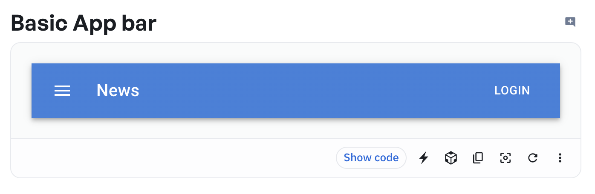

[**`Drawer`**](https://mui.com/material-ui/react-drawer/): Los cajones de navegación (_drawers_ o _sidebars_) permiten un acceso ergonómico a distintas secciones de un sitio o a funcionalidades de la aplicación, como cambiar de cuenta.

Un cajón de navegación puede estar siempre visible en pantalla (modo permanente) o ser controlado mediante un ícono de menú de navegación (modo temporal o deslizable).

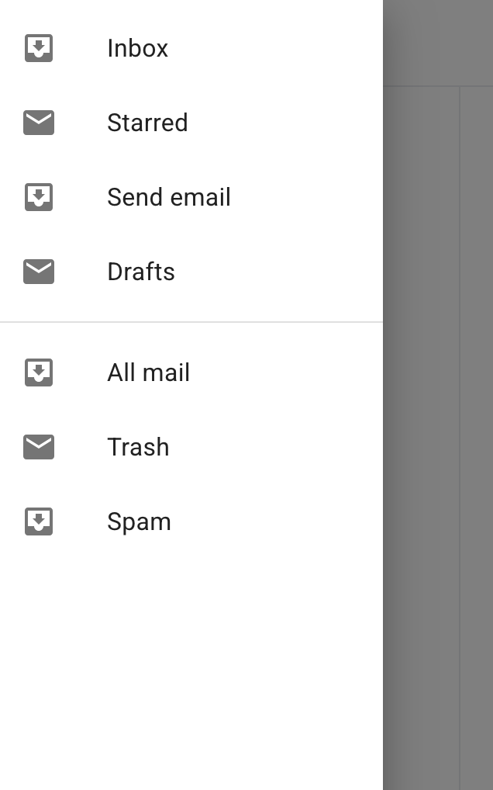

[**`Tabs`**](https://mui.com/material-ui/react-tabs/): Las pestañas (`Tabs`) facilitan la exploración y el cambio entre distintas vistas. Sirven para organizar y permitir la navegación entre grupos de contenido relacionados, que se encuentran en el mismo nivel de jerarquía dentro de la aplicación.

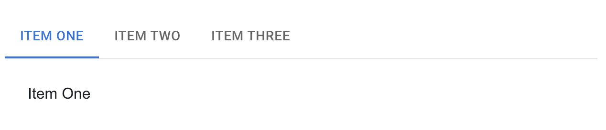

[**`BottomNavigation`**](https://mui.com/material-ui/react-bottom-navigation/): Estas barras muestran entre tres y cinco destinos en la parte inferior de la pantalla. Cada destino está representado por un ícono y, opcionalmente, una etiqueta de texto. Cuando el usuario toca uno de los íconos, es dirigido al destino de navegación de nivel superior asociado a ese ícono.

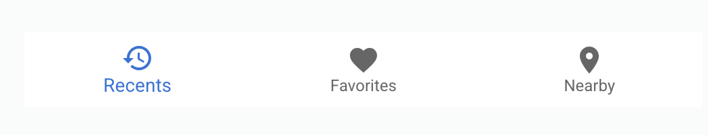

#### 2.2.2 Componentes de estructura y layout

[**`Container`**](https://mui.com/material-ui/react-container/): El componente `Container` centra tu contenido horizontalmente. Es la unidad de layout más básica en Material UI y se utiliza comúnmente para limitar el ancho máximo del contenido y aplicar márgenes automáticos.

Aunque es posible anidar contenedores, la mayoría de los diseños no requieren contenedores anidados.

Existen dos modos principales de uso:

* `fixed` (por defecto): aplica un ancho máximo que se ajusta a los puntos de corte (breakpoints) definidos en el tema (theme.breakpoints), ideal para layouts consistentes.

* `fluid` (`maxWidth={false}`): hace que el contenedor ocupe el 100% del ancho disponible, útil cuando se desea un diseño que se expanda por completo en pantallas grandes.

[**`Grid`**](https://mui.com/material-ui/react-grid/): El sistema de grilla (`Grid`) permite crear layouts responsivos que se adaptan al tamaño y la orientación de la pantalla, asegurando una presentación coherente en distintas resoluciones.

El componente `Grid` es ideal para diseñar interfaces con un número conocido de columnas. Permite definir cómo se distribuye el espacio entre los elementos hijos mediante una grilla de 12 columnas, y configurar cuántas columnas debe ocupar cada elemento según diferentes puntos de quiebre (breakpoints) (`xs`, `sm`, `md`, `lg`, `xl`), lo que facilita la adaptabilidad.

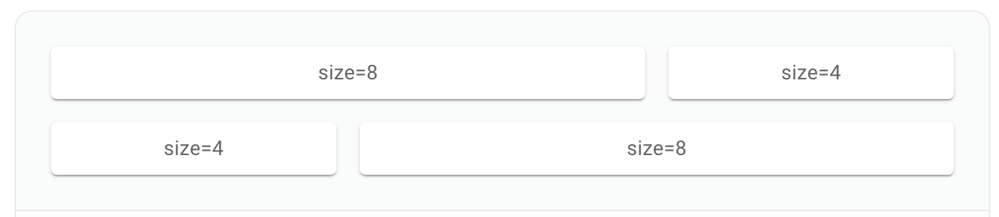

[**`Stack`**](https://mui.com/material-ui/react-stack/): Es un componente contenedor que permite organizar elementos de forma vertical u horizontal.

Específicamente, `Stack` gestiona el layout de sus elementos hijos inmediatos a lo largo de un eje único (vertical u horizontal), con opciones para agregar espaciado automático entre ellos, e incluso divisores (`Divider`) si se desea.

Es una solución sencilla y eficiente para diseños unidimensionales (por ejemplo, una columna de botones o una fila de chips). En cambio, si se necesita distribuir elementos en dos dimensiones (filas y columnas), es preferible utilizar el sistema `Grid`.

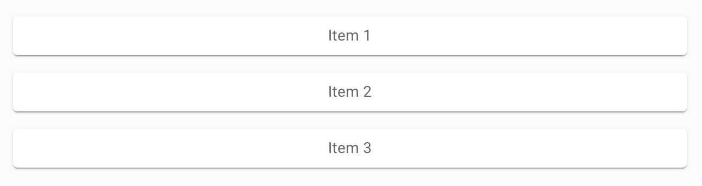

[**`Box`**](https://mui.com/material-ui/react-box/): El componente `Box` es un contenedor genérico para agrupar otros componentes. Es uno de los bloques fundamentales al trabajar con Material UI.

Puedes pensar en Box como un equivalente a una etiqueta `<div>`, pero con características adicionales incorporadas, como acceso directo al tema (_theme_) de la aplicación y la posibilidad de aplicar estilos de forma rápida y poderosa usando la propiedad `sx`.

Gracias a su flexibilidad, Box es ideal para estructurar y estilizar secciones del layout sin necesidad de definir clases CSS por separado.

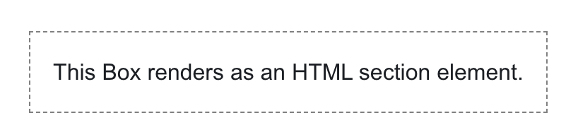

[**`Paper`**](https://mui.com/material-ui/react-paper/): El componente `Paper` es un contenedor visual que se utiliza para mostrar contenido sobre una superficie elevada.

Simula el aspecto de una hoja de papel con sombra (_elevation_) y fondo por defecto, lo que ayuda a destacar secciones dentro de una interfaz. Es útil para paneles, tarjetas, formularios o cualquier área que deba separarse visualmente del fondo.

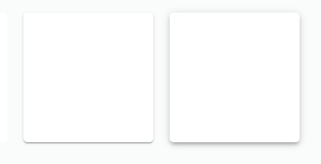

#### 2.2.3 Componentes de entradas

[**`TextField`**](https://mui.com/material-ui/react-text-field/): Los campos de texto (`TextField`) permiten a los usuarios ingresar y editar texto dentro de una interfaz.

Son uno de los elementos de entrada más comunes, y suelen aparecer en formularios y diálogos, por ejemplo para ingresar nombres, descripciones, direcciones o notas. Además de texto libre, pueden configurarse para validar formatos específicos, mostrar mensajes de error y adaptarse a distintos tamaños y variantes visuales.

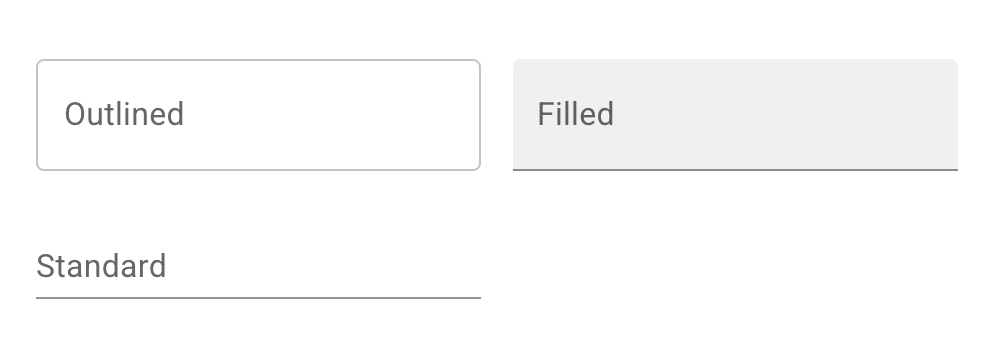

[**`Select`**](https://mui.com/material-ui/react-select/): El componente `Select` se utiliza para recoger información proporcionada por el usuario a partir de una lista de opciones predefinidas.

Es ideal cuando se desea limitar las respuestas posibles a un conjunto cerrado de valores, como seleccionar un país, una categoría de viaje, o el clima predominante durante una entrada en la bitácora. Puede combinarse con etiquetas (`label`), valores por defecto y comportamiento controlado.

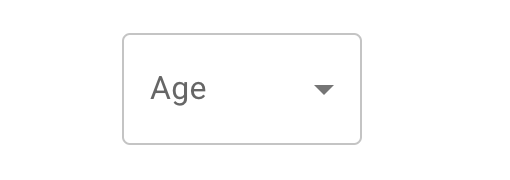

[**`Checkbox`**](https://mui.com/material-ui/react-checkbox/): Los checkboxes permiten al usuario seleccionar uno o más elementos dentro de un conjunto de opciones.

Se utilizan comúnmente para activar o desactivar opciones de forma individual. Cuando se presentan múltiples opciones en una lista, los checkboxes son una alternativa eficiente que ahorra espacio en comparación con los interruptores (switches).

Nota: Si tienes una sola opción binaria, es preferible usar un Switch en lugar de un checkbox, ya que comunica mejor el estado activo/inactivo de forma intuitiva.


[**`Radio Group`**](https://mui.com/material-ui/react-radio-button/): El componente `Radio Group` permite al usuario seleccionar una sola opción entre un conjunto de alternativas.

Se recomienda usar botones de opción (radio) cuando es importante que el usuario vea todas las opciones disponibles al mismo tiempo. Si las opciones pueden mostrarse de forma más compacta (por ejemplo, en un menú desplegable), considera usar un componente Select, ya que ocupa menos espacio.

Nota: Por buenas prácticas de usabilidad, la opción más común o recomendada debería estar seleccionada por defecto.

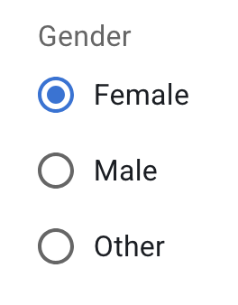

[**`Autocomplete`**](https://mui.com/material-ui/react-autocomplete/): El componente `Autocomplete` es un campo de texto normal que se mejora con un panel de sugerencias que aparece mientras el usuario escribe.

Este widget es útil para establecer el valor de una caja de texto de una sola línea en dos tipos de escenarios:

Selección restringida (combo box): el valor debe elegirse desde un conjunto predefinido, por ejemplo, un campo de ubicación que solo acepte nombres válidos.

Valor libre con sugerencias (free solo): el campo puede aceptar cualquier valor, pero es ventajoso sugerir opciones mientras el usuario escribe, por ejemplo, en un buscador que ofrece búsquedas previas o similares.

Autocomplete está diseñado como una versión mejorada de bibliotecas populares como react-select y downshift, ofreciendo integración nativa con Material UI, accesibilidad, theming y mayor facilidad de uso.

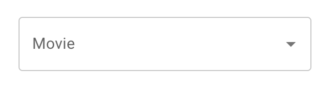

#### 2.2.4 Componentes de acción

[**`Button`**](https://mui.com/material-ui/react-button/): Los botones (`Button`) comunican las acciones que el usuario puede realizar dentro de la interfaz.

Son elementos fundamentales de interacción y suelen colocarse en diferentes partes de la UI, como por ejemplo:

* Ventanas modales (para confirmar o cancelar una acción)
* Formularios (para enviar datos o limpiar campos)
* Tarjetas (`Card`) (para acceder a más información o realizar una acción relacionada)
* Barras de herramientas (`Toolbar`) (para acciones frecuentes como guardar, filtrar, agregar)
* Material UI ofrece distintos estilos de botón (`text`, `outlined`, `contained`) y soporte para íconos, deshabilitados, tamaños y estados de carga.

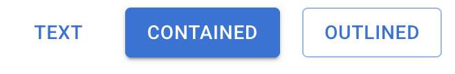

[**`Icons`**](https://mui.com/material-ui/icons/): Material UI ofrece soporte para íconos de tres formas principales:

* Material Icons como componentes React (íconos SVG): Se proveen miles de íconos oficiales exportados como componentes desde el paquete `@mui/icons-material`. Esta es la forma más directa y recomendada de usar íconos.
* Componente `SvgIcon`: Permite envolver tus propios íconos SVG personalizados dentro de un componente React, aplicando los estilos y propiedades del sistema de diseño.
* Componente `Icon`: Sirve para usar íconos basados en fuentes (font icons), como los que provienen de bibliotecas como Material Icons font o Font Awesome, aunque se recomienda preferir SVG por accesibilidad y control visual.

Google ha creado más de 2.100 íconos oficiales de Material Design, disponibles en cinco estilos visuales distintos (por ejemplo: `Filled`, `Outlined`, `Rounded`, `Two Tone`, `Sharp`). Cada uno de estos íconos está disponible como componente individual en el paquete `@mui/icons-material`.

Puedes explorar la galería completa de íconos en:
[https://mui.com/components/material-icons/](https://mui.com/components/material-icons/)

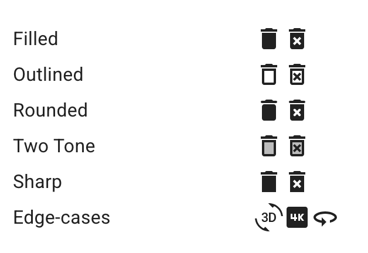

[**`SpeedDial`**](https://mui.com/material-ui/react-speed-dial/): El componente SpeedDial permite mostrar un conjunto de acciones relacionadas cuando el usuario presiona un botón flotante de acción (FAB).

Al activarse, el botón revela entre tres y seis acciones secundarias que se presentan de forma radial o vertical. Este patrón es especialmente útil en aplicaciones móviles, donde el espacio es limitado y se desea ofrecer accesos rápidos a funciones comunes o complementarias.

Nota: Si se necesitan más de seis acciones, se recomienda usar otro tipo de componente, como un menú o un panel, para evitar sobrecargar la interfaz.

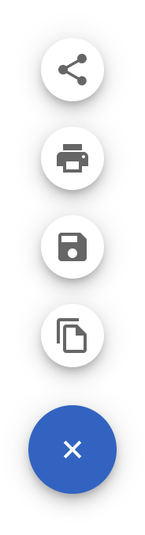

#### 2.2.5 Componentes de visualización de datos

[**`Card`**](https://mui.com/material-ui/react-card/): Las tarjetas (Card) contienen contenido y acciones relacionadas con un único tema o entidad.

En Material UI, una Card es una superficie visual que agrupa elementos de interfaz vinculados a un mismo tópico —por ejemplo, una entrada de bitácora, una publicación, un producto o una notificación. Este componente incluye una serie de subcomponentes utilitarios que permiten cubrir distintos casos de uso:

* `Card`: contenedor principal que define la superficie de la tarjeta.
* `CardContent`: envoltorio para el contenido textual o estructurado de la tarjeta.
* `CardHeader` (opcional): sección superior de la tarjeta que puede incluir título, subtítulo y avatar.
* `CardMedia` (opcional): área para mostrar imágenes, videos o contenido visual relacionado.
* `CardActions` (opcional): contenedor para agrupar botones u otras acciones relacionadas.
* `CardActionArea` (opcional): área interactiva que permite que una parte de la tarjeta actúe como enlace o zona de interacción completa.

Este patrón es especialmente útil para mostrar listas de entradas, por ejemplo, en una aplicación de ecommerce, donde cada tarjeta puede representar un producto con su imagen destacada, título, fecha y botones de acción como ver más, editar o eliminar.

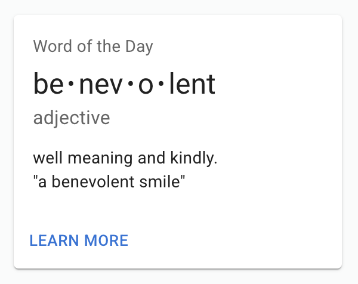

[**`List`**](https://mui.com/material-ui/react-list/): Las listas (`List`) son grupos continuos y verticales de texto, íconos o imágenes, organizados en forma secuencial.

Cada lista está compuesta por una serie de ítems (`ListItem`), que pueden incluir acciones principales y complementarias, representadas mediante texto e íconos. Son útiles para mostrar información de forma compacta y navegable, como listas de ubicaciones visitadas, tareas pendientes o registros cronológicos.

Material UI ofrece componentes auxiliares para enriquecer las listas, como:

* `ListItemText`: para mostrar texto principal y secundario.
* `ListItemIcon`: para mostrar íconos asociados a cada entrada.
* `ListItemButton`: para hacer que los ítems sean interactivos.
* `ListSubheader`: para organizar visualmente la lista en secciones.

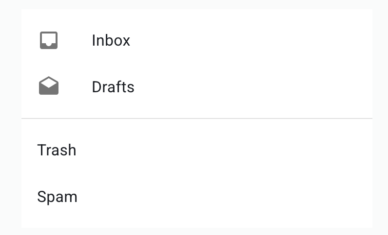

[**`Table`**](https://mui.com/material-ui/react-table/): Las tablas (`Table`) muestran información de forma estructurada y fácil de escanear, permitiendo a los usuarios identificar patrones, comparar datos y extraer conclusiones rápidamente.

Las tablas pueden incrustarse dentro del contenido principal de una interfaz, como en una `Card` o una vista de detalle. Además, pueden incluir funcionalidades complementarias como:

Visualizaciones asociadas (por ejemplo, íconos, colores o gráficas integradas)

Navegación (vínculos o botones por fila)

Herramientas para consultar o manipular los datos (como filtros, ordenamientos o acciones masivas)

En el contexto de una tienda de ecommerce, una tabla puede utilizarse para mostrar un listado de productos, con opciones para editar o eliminar cada registro.

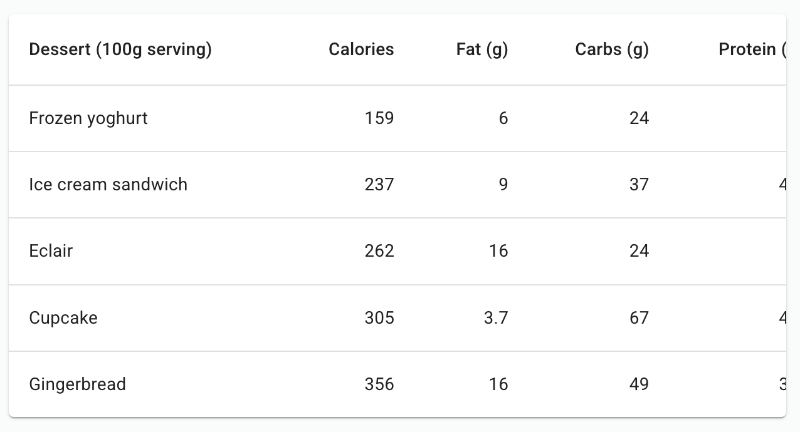

[**`Chip`**](https://mui.com/material-ui/react-chip/): Los chips (`Chip`) son elementos compactos que representan una entrada, atributo o acción dentro de una interfaz.

Pueden utilizarse para que el usuario ingrese información, haga selecciones, filtre contenido o dispare acciones rápidas. Por su tamaño reducido y estilo visual distintivo, los chips son útiles para mostrar etiquetas, categorías, palabras clave o estados.

Aunque aquí se presentan como un componente independiente, su uso más común es como parte de un flujo de entrada o filtrado, por ejemplo: chips que se activan al seleccionar intereses, destinos o etiquetas, o chips que aparecen al ingresar múltiples valores en un campo.


[**`Avatar`**](https://mui.com/material-ui/react-avatar/): Los avatares (`Avatar`) son elementos visuales utilizados para representar a una persona, entidad o elemento gráfico dentro de la interfaz.

En Material Design, los avatares aparecen en una amplia variedad de contextos, como tablas, menús de diálogo, tarjetas, listas o cabeceras de usuario. Pueden mostrar una imagen, iniciales o un ícono, y ayudan a mejorar la identificación visual de elementos en la interfaz.

En tu aplicación del proyecto, podrías usar avatares para representar al usuario, contactos relacionados con el viaje o incluso íconos de destinos visitados.


[**`Typography`**](https://mui.com/material-ui/react-typography/): El componente `Typography` se utiliza para presentar texto de manera clara, legible y estructurada, alineado con los principios visuales de Material Design.

La tipografía no solo comunica contenido, sino también jerarquía, énfasis e intención. Material UI incluye variantes predefinidas como `h1` a `h6`, `subtitle1`, `body1`, `caption`, entre otras, que permiten organizar visualmente títulos, subtítulos, párrafos y etiquetas sin necesidad de definir estilos personalizados.

En tu aplicación del proyecto, puedes usar `Typography` para resaltar títulos de entradas, fechas de viaje, descripciones y cualquier otro texto que deba ser presentado de forma coherente y accesible.

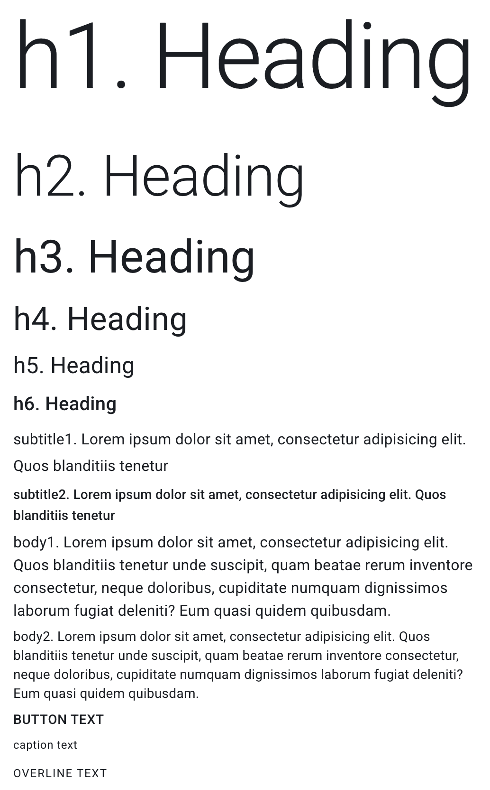

#### 2.2.6 Feedback al Usuario

[**`Snackbar`**](https://mui.com/material-ui/react-snackbar/): Los `Snackbars` (también conocidos como _toasts_) se utilizan para mostrar notificaciones breves sobre procesos que ya se han realizado o que están por realizarse.

Aparecen generalmente en la parte inferior de la pantalla y desaparecen automáticamente después de unos segundos, sin interrumpir la interacción del usuario. Son útiles, por ejemplo, para confirmar que una entrada fue guardada o eliminada exitosamente.


[**`Alert`**](https://mui.com/material-ui/react-alert/): El componente `Alert` muestra mensajes breves y directos al usuario, como advertencias, errores, confirmaciones o información adicional, sin bloquear el flujo de la aplicación.

Puede incluir íconos, colores específicos según el tipo de mensaje (`success`, `error`, `warning`, `info`) y acciones opcionales como botones para deshacer una operación.

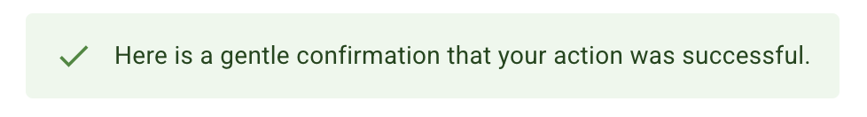

[**`Dialog`**](https://mui.com/material-ui/react-dialog/): Los diálogos (`Dialog`) son ventanas modales que aparecen por encima del contenido principal de la aplicación para mostrar información crítica, pedir decisiones o permitir tareas complejas.

Un `Dialog` bloquea la funcionalidad del resto de la app mientras está activo y permanece en pantalla hasta que el usuario lo confirme, lo cancele o complete la acción requerida. Por su carácter intrusivo, se recomienda usarlos con moderación y solo cuando la situación lo justifique (por ejemplo, al eliminar una entrada importante o confirmar una acción irreversible).

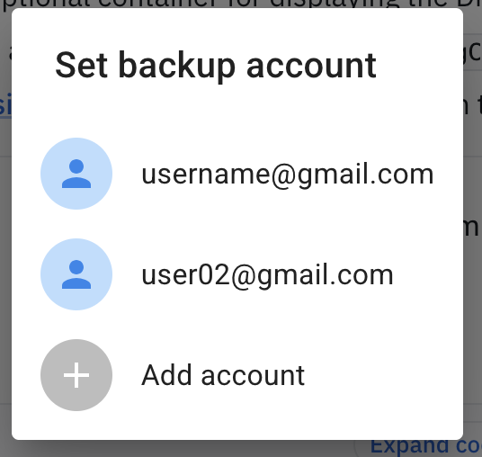

[**`Progress`**](https://mui.com/material-ui/react-progress/): Los indicadores de progreso (`Progress`) informan al usuario sobre el estado de procesos en curso, como cargar contenido, enviar formularios o guardar cambios.
* Los indicadores determinados muestran qué porcentaje del proceso ha sido completado.
* Los indicadores indeterminados (también conocidos como spinners) indican una espera sin duración específica.
Estos componentes dependen principalmente de animaciones CSS, por lo que pueden visualizarse incluso antes de que el JavaScript esté completamente cargado.

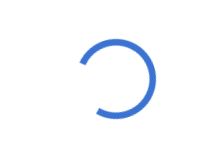

[**`Backdrop`**](https://mui.com/material-ui/react-backdrop/): El componente `Backdrop` agrega una capa atenuada (oscurecida) sobre la interfaz para dirigir la atención del usuario a un elemento específico, como un diálogo, formulario de carga o una animación de espera.

También se utiliza para señalar que la aplicación ha cambiado de estado (por ejemplo, cuando se activa un proceso bloqueante). Es una herramienta útil para crear efectos de enfoque visual o bloqueo temporal de la interacción con el resto de la interfaz.

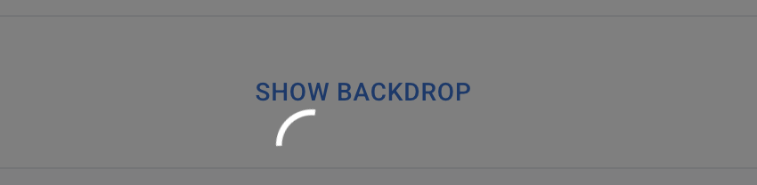

#### 2.2.7 Media y Contenido

[**`ImageList`**](https://mui.com/material-ui/react-image-list/): El componente `ImageList` permite mostrar una colección de imágenes organizadas en una grilla estructurada.

Las listas de imágenes representan una serie de elementos visuales repetidos, facilitando la exploración y comprensión del contenido. Son especialmente útiles cuando se desea mostrar galerías, álbumes, catálogos de destinos o cualquier colección gráfica. Material UI permite personalizar el número de columnas, el espaciado y la disposición (mosaico, estándar, etc.).


[**`Divider`**](https://mui.com/material-ui/react-divider/): El componente `Divider` proporciona una línea delgada y discreta que se utiliza para separar visualmente secciones o agrupar elementos relacionados dentro de una interfaz.

Es útil para reforzar la jerarquía visual sin distraer al usuario, y puede utilizarse entre listas, dentro de formularios, tarjetas o cualquier área donde sea necesario distinguir claramente partes del contenido.


#### 2.2.8 Utilidades

[**`Modal`**](https://mui.com/material-ui/react-modal/): El componente `Modal` proporciona una base sólida para construir elementos como diálogos, _popovers_, _lightboxes_, o cualquier otro contenido que deba aparecer por encima de la interfaz principal.

Cuando se activa, `Modal` renderiza su contenido sobre un componente `Backdrop`, deshabilitando la interacción con el contenido inferior. Entre sus principales características:

* Maneja múltiples modales apilados, si fuera necesario.
* Bloquea la interacción con el fondo mediante un backdrop.
* Desactiva el scroll de la página mientras el modal está abierto.
* Gestiona correctamente el foco: lo traslada al contenido del modal y lo mantiene ahí hasta que se cierre.
* Agrega roles ARIA automáticamente, mejorando la accesibilidad.

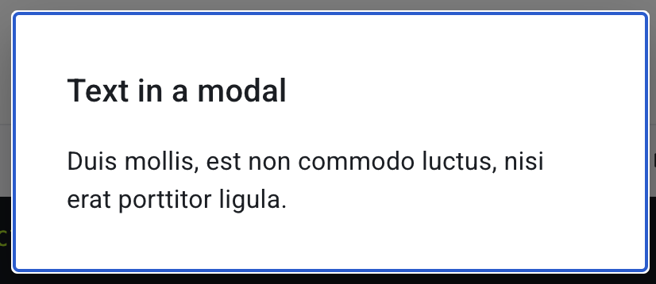

[**`Tooltip`**](https://mui.com/material-ui/react-tooltip/): El componente `Tooltip` muestra un texto informativo cuando el usuario pasa el cursor, enfoca o toca un elemento de la interfaz.

Se utiliza para describir la función o propósito de un ícono, botón u otro componente interactivo sin ocupar espacio permanente en la pantalla. Es útil en casos donde se quiere dar contexto sin saturar visualmente la UI.

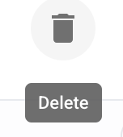

[**`Popover`**](https://mui.com/material-ui/react-popover/): El componente `Popover` permite mostrar contenido superpuesto sobre otro elemento, de forma más extensa o personalizada que un `Tooltip`.

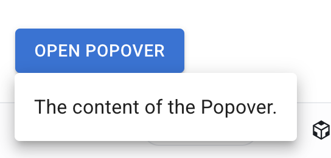

Características clave:

* Está construido sobre el componente `Modal`, por lo que hereda su gestión de foco, backdrop y bloqueo de scroll.
* Bloquea el scroll y clics fuera del área del popover, a diferencia del componente Popper, que permite interacciones externas.
* Se usa comúnmente para menús contextuales, descripciones ampliadas o controles agrupados que se activan desde un botón o ícono.

[**`Badge`**](https://mui.com/material-ui/react-badge/): El componente `Badge` genera una pequeña insignia visual que se superpone sobre su(s) hijo(s), comúnmente ubicada en la esquina superior derecha.

Se utiliza para indicar notificaciones, contadores o estados, por ejemplo: número de mensajes no leídos, estado en línea, o elementos en un carrito. Puede combinarse fácilmente con `IconButton`, `Avatar` o `Tab`.

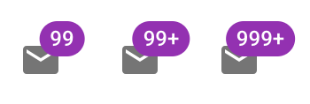

**Tiempo y Fechas**: La biblioteca MUI X para React contiene varios componentes inspirados en Material Design para implementar controles de selección de tiempo y fechas. La documentación completa con ejemplos está disponible en [https://mui.com/x/react-date-pickers/](https://mui.com/x/react-date-pickers/).

## 3. Prototipado de Interfaz de Usuario con Figma y Material UI

Figma es una de las herramientas más populares para diseñar y prototipar interfaces de usuario. Funciona completamente en línea, lo que permite el trabajo colaborativo en tiempo real, facilitando que equipos de diseño y desarrollo trabajen sobre el mismo proyecto desde cualquier lugar. Gracias a su enfoque en el diseño visual con estructura de capas y componentes reutilizables, Figma permite crear maquetas y flujos de navegación que simulan el comportamiento real de una aplicación sin necesidad de escribir código.

Una de las mayores ventajas de Figma para este curso es que puedes acceder a una licencia educacional gratuita con tu correo institucional. Esta licencia permite colaborar en equipos, utilizar bibliotecas compartidas y acceder a funcionalidades premium sin costo. Para solicitarla, visita:
🔗 https://www.figma.com/education/

Como trabajaremos con Material UI, Figma ofrece UI kits oficiales que ya incluyen los componentes del sistema de diseño de Google. Esto significa que los elementos que diseñes en Figma los podrás encontrar en la biblioteca de React, respetando estilos, jerarquía visual y patrones de interacción. Concretamente, al construir tu aplicación TravelLog, podrás usar Figma para prototipar pantallas como el listado de viajes, el formulario para registrar una nueva entrada o la galería de imágenes, asegurándote de que el diseño esté alineado con lo que luego implementarás usando MUI en React.

UI Kits sugeridos:

* [Material 3 Design Kit](https://www.figma.com/community/file/1035203688168086460) — Versión oficial de Material Design 3 de Google. Útil para seguir las guías más recientes de diseño móvil.
* [Material UI for Figma (and MUI X)](https://www.figma.com/community/file/912837788133317724/material-ui-for-figma-and-mui-x) — Kit adaptado a la librería MUI de React, ideal para diseñar componentes que luego implementaremos en el proyecto.
* [Minimal Mockups](https://www.figma.com/design/3uoWgyChDi0RDQGsfTa7G6?fuid=1404551889925454225) — Conjunto de device mockups minimalistas para presentar tu diseño dentro de un marco de teléfono.

Nota: También estará permitido usar Axure RP. Sin embargo, para prototipar con MUI en Axure se requieren bibliotecas de componentes generalmente comerciales, para las cuales no contamos con licencia en el curso.

## 3.1 Cómo habilitar un UI kit en tu archivo de Figma

Abre el enlace del UI kit y haz clic en Duplicate para guardarlo en tu espacio de trabajo.

* Desde el archivo duplicado, ve al panel Assets → Libraries (icono de libro) y haz clic en Publish para publicarlo como biblioteca.
* Abre el archivo de tu proyecto y, en el mismo panel Assets, activa la biblioteca para que sus componentes estén disponibles.
* Ahora podrás arrastrar componentes desde el panel Assets o buscarlos por nombre, sin necesidad de abrir el archivo original.

## 3.2 Copiar/pegar vs. usar bibliotecas publicadas

**Copiar/pegar:** Útil para elementos únicos o cuando necesitas modificar el diseño de manera libre sin mantener vínculo con el original. Común para usar ejemplos completos que vienen en los kits como “pantallas de muestra”.

**Usar como biblioteca:** Permite insertar instancias de componentes que mantienen vínculo con el original. Si el componente en la biblioteca cambia (por ejemplo, un color o tipografía), podrás actualizar todas las instancias en tu proyecto de forma centralizada.

**Recomendación:** Para elementos básicos como botones, campos de texto o tipografía, usa la biblioteca publicada. Para mockups de dispositivos o layouts de ejemplo, copiar/pegar es suficiente.

## 3.3 Prototipado de una vista de Login con Figma

Sigue estos pasos para crear tu primera pantalla de interfaz: el formulario de inicio de sesión (Login) de una aplicación móvil. Este diseño servirá como base para la implementación posterior en React usando Material UI.

**Paso 1.** Crea un nuevo archivo de diseño
* Abre [https://www.figma.com/](https://www.figma.com/) e inicia sesión.
* Haz clic en "New design file".
* Cambia el nombre del archivo a algo como Login UI.

**Paso 2.** Crea un frame con tamaño adecuado. 
* Inserta un Frame del tipo Phone (e.g., iPhone 13/14) o define tu propio tamaño (por ejemplo, 360x640).
* Activa Auto Layout para asegurar que los elementos se distribuyan con consistencia vertical y sean fáciles de reordenar.
* Agrega márgenes laterales de al menos 16px y un espaciado vertical de 24px entre elementos.

**Paso 3.** Diseña la estructura de la vista. 

* Dentro del frame, organiza los elementos de la siguiente forma:

```
[ Logo de TravelLog o ícono de Avatar (opcional) ]
[ Título: "Iniciar sesión" (Typography) ]
[ TextField: Correo electrónico ]
[ TextField: Contraseña ]
[ Checkbox + Texto: "Recordarme" ]
[ Enlace: "¿Olvidaste tu contraseña?" ]
[ Botón: "Iniciar sesión" ]
[ Enlace secundario: "¿No tienes cuenta? Regístrate" ]
```

* Asegúrate de alinear todos los campos verticalmente.
* Usa variantes del sistema tipográfico de Material (`h5`, `body1`, `caption`).
* Usa botones `contained` para acciones primarias, y `text` para enlaces.

**Paso 4.** Aplica estilos desde el sistema de Material Design
* Usa colores, fuentes y tamaños definidos en el tema base del kit.
* Aplica elevación o un contenedor (`Card`, `Paper`) si quieres resaltar el formulario sobre un fondo.

**Paso 5.** Prototipa la navegación básica. 
* Agrega un segundo frame vacío llamado "Home".
* Usa la pestaña Prototype en Figma para vincular el botón "Iniciar sesión" a ese segundo frame como si fuera la pantalla siguiente tras autenticarse.

**Paso 6.** Verifica y presenta.
* Usa Present para visualizar la experiencia en modo interactivo.
* Exporta tu prototipo como PDF o comparte el enlace con tu equipo.